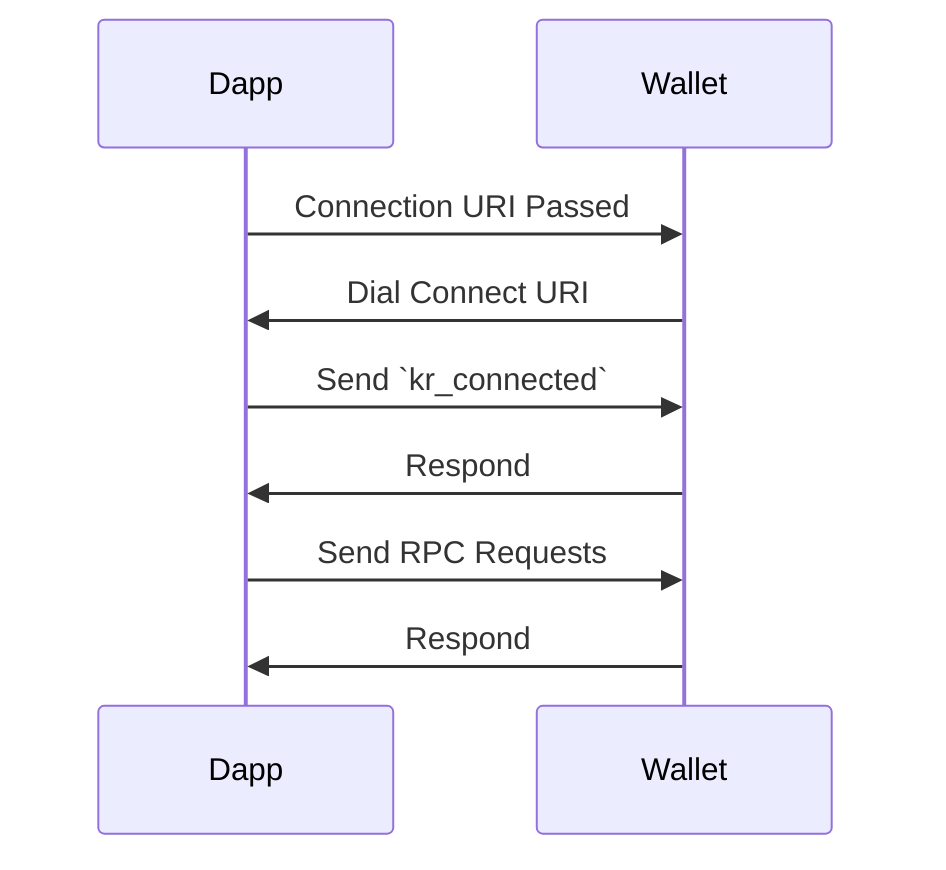

# Krypton 0.1.0
> [!NOTE] This has been written enterly by `per1odical` and has not been reviewed by anyone else. This should be considered a draft and not final. Realistically this should be an EIP developed by the community.

## Connection Flow


## RPC Methods
### `kr_connected`
- **Description**: Sent by the dapp to the wallet to signal that the connection has been established.
- **Parameters**:
  1. ```ts
      {
        /// The name of the dapp
        name: string;
        /// The URI of the dapp, defaults to `window.location.origin`` if not provided and running in a browser.
        uri?: string;
        /// The logo of the dapp
        image_uri?: string;
        /// The chains the dapp is interested in
        requestedChains: { [key: number]: string[]; }
        /// Chains that are needed for a successful connection
        requiredChains?: number[];
      }
     ```
- **Response**:
  1. ```ts
      {
        /// The name of the wallet
        name: string;
        /// The logo of the wallet
        image_uri?: string;
        /// The chains & methods that the wallet supports
        supportedChains: { [key: number]: string[] }
      }
    ```

### `kr_identities`
- **Description**: Sent to the wallet to ask for all addresses/identities that the wallet has.
- **Parameters**: None
- **Response**:
  1. ```ts
      /// Map where the key is the chain id and the value is an array of addresses
      { [key: number]: string[] }
    ```

### `kr_sign`
- **Description**: Sent to the wallet to ask for a signature.
- **Parameters**:
  1. address to use for signing (number)
  2. message to sign (string)
- **Response**:
  1. signature (string)
